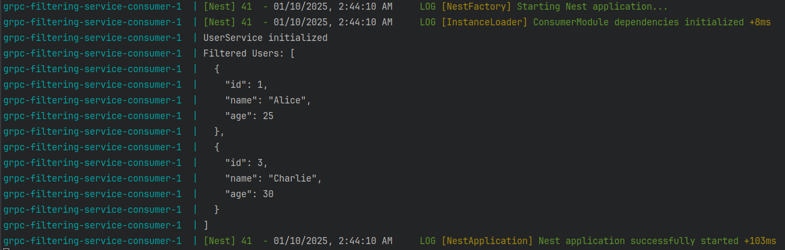

# grpc-filtering-service

# Technical Assignment

## Microservices start

1. Copy & rename `.env.example` to `.env`
2. Run the following command to build and start the services:
```bash
  docker-compose up --build
```

## Result



## Project`s structure (Producer/Consumer)
```
.
├── consumer
|   ├── Dockerfile
|   ├── nest-cli.json
|   ├── package.json
|   ├── README.md
|   ├── src
|   |   ├── consumer.controller.spec.ts
|   |   ├── consumer.controller.ts
|   |   ├── consumer.module.ts
|   |   ├── consumer.service.ts
|   |   ├── index.ts
|   |   ├── interfaces
|   |   |   ├── index.ts
|   |   |   ├── user.interface.ts
|   |   |   └── user-service.interface.ts
|   |   └── main.ts
|   ├── tsconfig.build.json
|   ├── tsconfig.json
|   └── yarn.lock
├── docker-compose.yml
├── producer
|   ├── copy-files.js
|   ├── Dockerfile
|   ├── nest-cli.json
|   ├── package.json
|   ├── README.md
|   ├── src
|   |   ├── data
|   |   |   └── users.json
|   |   ├── index.ts
|   |   ├── main.ts
|   |   ├── producer.controller.spec.ts
|   |   ├── producer.controller.ts
|   |   ├── producer.module.ts
|   |   └── producer.service.ts
|   ├── test
|   |   ├── app.e2e-spec.ts
|   |   └── jest-e2e.json
|   ├── tsconfig.build.json
|   ├── tsconfig.json
|   └── yarn.lock
├── README.md
├── shared
|   └── users.proto
├── temp
|   └── res.png
```
## Thank you for the interesting task!
### @Serhii_Smoliak